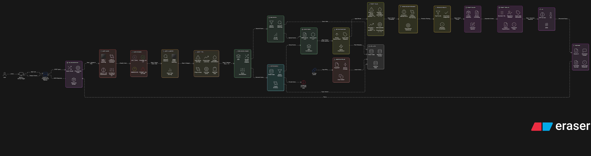

# PharmaRAG 🧬

> **Intelligent Regulatory Document Assistant** — A production-grade RAG system for querying FDA drug labels with pharmaceutical domain expertise.

[](https://ayushmahandule1208.github.io/pharma-rag/)
[](https://huggingface.co/spaces/ayushmahandule12/pharma-rag-api)
[](https://python.org)


---

## 🏗️ Architecture Overview

<p align="center">
  
</p>

---

## 🎯 What This Project Demonstrates

This isn't just a "PDF chatbot." It's a **carefully engineered RAG pipeline** designed for the pharmaceutical/regulatory domain, showcasing:

- **Multi-layer query validation** (not just "ask anything")
- **Hybrid retrieval** (sparse + dense, not just embeddings)
- **Cross-encoder reranking** (two-stage retrieval)
- **Domain-aware response generation** (query-type specific prompting)
- **Production considerations** (caching, logging, error handling)

---

---

## 🔬 RAG Pipeline Deep Dive

### Step 1: Query Guard — Why Filter Queries?

**The Problem:** Generic RAG systems answer everything, including:
- "How are you?" → Returns random drug info (embarrassing)
- "Ignore previous instructions..." → Prompt injection attacks
- "What's the weather?" → Wastes API calls on irrelevant queries

**My Solution: 3-Layer Guard**

```python
# Layer 1: Fast regex patterns (< 1ms)
PHARMA_PATTERNS = [r'\b(drug|medication|dose|side effect|FDA)\b', ...]
OFF_TOPIC_PATTERNS = [r'\b(weather|sports|recipe|code)\b', ...]

# Layer 2: Embedding similarity (~ 50ms)
# Compare query embedding to known pharma/off-topic centroids

# Layer 3: LLM classification (~ 500ms, only for ambiguous cases)
# "Is this query about pharmaceutical/regulatory topics?"
```

| Layer | Speed | Accuracy | When Used |
|-------|-------|----------|-----------|
| Regex | < 1ms | 70% | Always (first pass) |
| Embedding | ~50ms | 85% | If regex uncertain |
| LLM | ~500ms | 95% | Only edge cases |

**Tradeoff:** Adding guard layers increases latency by 50-500ms, but prevents embarrassing failures and saves API costs on irrelevant queries.

---

### Step 2: Query Classification — Why Categorize?

**The Problem:** Not all pharma queries are equal:
- "Is Ozempic safe?" → Need Boxed Warnings, Adverse Reactions
- "How does Keytruda work?" → Need Mechanism of Action
- "Ozempic dosing for diabetes" → Need Dosage & Administration

**My Solution: Query-Type Detection**

```python
QUERY_PATTERNS = {
    QueryType.SAFETY: [
        r'\b(side effect|adverse|warning|contraindication|risk|death)\b',
        r'\bcan .* cause\b', r'\bis .* safe\b'
    ],
    QueryType.DOSING: [
        r'\b(dose|dosage|mg|how much|how often|administration)\b'
    ],
    # ... more patterns
}
```

**Why Regex over ML?**
- Interpretable (can debug why a query was classified)
- Fast (< 1ms vs 100ms+ for ML)
- No training data needed
- Good enough for this domain (pharma vocabulary is predictable)

**Tradeoff:** Regex misses nuanced queries like "Should elderly patients take less?" (no explicit "dose" keyword). I accept this tradeoff because:
1. Most real pharma queries use explicit terminology
2. The system still retrieves relevant content, just with less section boosting

---

### Step 3: Hybrid Retrieval — Why Both BM25 and Vectors?

**The Problem:** Each retrieval method has blind spots:

| Method | Strength | Weakness |
|--------|----------|----------|
| **BM25 (Sparse)** | Exact matches, drug names, numbers | Misses synonyms ("heart attack" vs "myocardial infarction") |
| **Vectors (Dense)** | Semantic similarity, paraphrases | Misses exact terms, dilutes rare words |

**My Solution: Hybrid with Reciprocal Rank Fusion**

```python
def hybrid_search(query: str, top_k: int = 5):
    # Get candidates from both methods
    bm25_results = bm25_index.search(query, top_k=top_k * 3)
    vector_results = faiss_index.search(query, top_k=top_k * 3)
    
    # Reciprocal Rank Fusion
    combined_scores = {}
    for rank, doc in enumerate(bm25_results):
        combined_scores[doc.id] = combined_scores.get(doc.id, 0) + 1 / (60 + rank)
    for rank, doc in enumerate(vector_results):
        combined_scores[doc.id] = combined_scores.get(doc.id, 0) + 1 / (60 + rank)
    
    return sorted(combined_scores.items(), key=lambda x: x[1], reverse=True)[:top_k]
```

**Why RRF over Weighted Average?**
- RRF is **rank-based**, not score-based (no normalization needed)
- Works when BM25 and vector scores are on different scales
- Proven in literature (used by Elasticsearch, Vespa)

**Tradeoff:** Hybrid search is 2x slower than single-method search. Worth it because recall improves significantly for pharmaceutical queries where both exact terms (drug names, dosages) and semantic meaning (symptoms, conditions) matter.

---

### Step 4: Section Prioritization — Why Boost Certain Sections?

**The Problem:** FDA drug labels have standard sections. For safety queries, "Boxed Warning" is more important than "Description." Vector similarity alone doesn't capture this.

**My Solution: Query-Type Aware Boosting**

```python
SECTION_BOOSTS = {
    QueryType.SAFETY: {
        "priority_sections": ["boxed warning", "warnings", "adverse reactions"],
        "boost_factor": 1.5
    },
    QueryType.DOSING: {
        "priority_sections": ["dosage and administration"],
        "boost_factor": 1.5
    },
    QueryType.EFFICACY: {
        "priority_sections": ["clinical studies", "clinical trials"],
        "boost_factor": 1.3
    }
}
```

**Why Multiplicative Boost?**
- Additive boost would override retrieval scores entirely
- Multiplicative preserves relative ranking while amplifying priority sections
- 1.5x boost means a priority section needs to be ~33% less similar to still rank higher

**Tradeoff:** Risk of over-boosting irrelevant content if section detection is wrong. Mitigated by:
1. FDA labels have consistent section naming
2. Boost factor is moderate (1.5x, not 10x)
3. Cross-encoder reranking catches mistakes

---

### Step 5: Cross-Encoder Reranking — Why a Second Ranking Pass?

**The Problem:** Bi-encoder retrieval (FAISS) is fast but imprecise:
- Encodes query and document **separately**
- Can't capture fine-grained query-document interactions

**My Solution: Cross-Encoder Reranking**

```python
from sentence_transformers import CrossEncoder

reranker = CrossEncoder('cross-encoder/ms-marco-MiniLM-L-6-v2')

def rerank(query: str, candidates: list[str], top_k: int = 5):
    # Cross-encoder sees (query, document) pairs together
    pairs = [(query, doc.text) for doc in candidates]
    scores = reranker.predict(pairs)
    
    # Return top-k by cross-encoder score
    ranked = sorted(zip(candidates, scores), key=lambda x: x[1], reverse=True)
    return [doc for doc, score in ranked[:top_k]]
```

**Why Cross-Encoder?**
| Approach | Speed | Quality | Use Case |
|----------|-------|---------|----------|
| Bi-encoder (FAISS) | Fast (1ms/1000 docs) | Good | Initial retrieval |
| Cross-encoder | Slow (100ms/100 docs) | Excellent | Reranking top candidates |

**Tradeoff:** Adds ~200ms latency. Worth it because:
1. Only reranks top 15 candidates, not entire corpus
2. Significantly improves precision for top-5 results
3. Pharmaceutical queries demand high accuracy (wrong drug info is dangerous)

---

### Step 6: Prompt Building — Why Query-Type Specific?

**The Problem:** Generic prompts produce generic answers:
```
# Bad: Same prompt for all queries
"Answer the question using the context provided."
```

**My Solution: Query-Type Instructions**

```python
QUERY_INSTRUCTIONS = {
    QueryType.SAFETY: """
        IMPORTANT: Always mention Boxed Warnings FIRST if present.
        Use exact regulatory language from the label.
        Include severity indicators (serious, life-threatening, fatal).
    """,
    QueryType.DOSING: """
        Provide EXACT dosing as stated in the label.
        Include route of administration.
        Mention any dose adjustments (renal, hepatic, age).
    """,
    QueryType.EFFICACY: """
        Include specific endpoints and statistical results.
        Mention study population and duration.
        Note any limitations stated in the label.
    """
}
```

**Why This Matters:**
- Safety queries need Boxed Warnings first (regulatory requirement)
- Dosing queries need exact numbers (clinical necessity)
- Efficacy queries need statistics (evidence-based medicine)

**Tradeoff:** More complex prompt engineering, but significantly better response quality for specialized queries.

---

### Step 7: LLM Generation — Why GPT-4o-mini?

**Options Considered:**

| Model | Quality | Speed | Cost | Context |
|-------|---------|-------|------|---------|
| GPT-4o | Best | Slow | $$$ | 128K |
| **GPT-4o-mini** | Great | Fast | $ | 128K |
| Claude 3.5 Sonnet | Best | Medium | $$ | 200K |
| Llama 3 70B | Good | Varies | Free | 8K |

**Why GPT-4o-mini?**
1. **Best quality/cost ratio** for structured extraction tasks
2. **128K context** fits multiple drug label sections
3. **Fast** (~500ms) for good UX
4. **Reliable** — consistent output format for citations

**Tradeoff:** Proprietary model = API dependency. Acceptable because:
- Open models require GPU hosting (expensive)
- Quality gap is significant for regulatory language
- OpenAI API is reliable enough for demo/portfolio

---

## 📁 Data: FDA Drug Labels

The system contains **25 FDA-approved drug labels** covering major therapeutic areas:

| Category | Drugs |
|----------|-------|
| **Diabetes/Obesity** | Ozempic, Wegovy, Mounjaro, Jardiance, Trulicity, Rybelsus |
| **Oncology** | Keytruda, Opdivo |
| **Immunology** | Humira, Dupixent, Stelara, Enbrel, Cosentyx, Rinvoq, Skyrizi, Taltz, Tremfya, Otezla |
| **Cardiology** | Eliquis, Xarelto, Entresto, Repatha, Praluent |
| **Neurology** | Tecfidera, Ocrevus |

**Why These Drugs?**
- Top-prescribed medications (real-world relevance)
- Diverse label structures (good test coverage)
- Complex safety profiles (challenging retrieval)

---

## 🏗️ Technical Stack

| Component | Technology | Why |
|-----------|------------|-----|
| **Backend** | FastAPI | Async, fast, automatic OpenAPI docs |
| **Vector Store** | FAISS | Lightweight, no server needed, HF Spaces compatible |
| **Keyword Index** | Custom BM25 | Simple, effective, no Elasticsearch overhead |
| **Embeddings** | all-MiniLM-L6-v2 | Fast, good quality, 384 dims (efficient) |
| **Reranker** | ms-marco-MiniLM-L6 | Best small cross-encoder for retrieval |
| **LLM** | GPT-4o-mini | Best quality/cost for structured generation |
| **Database** | SQLite | Simple, file-based, sufficient for demo scale |
| **Frontend** | Next.js + Tailwind | Static export for GitHub Pages |
| **Hosting** | HF Spaces + GitHub Pages | Free, reliable, good for portfolio |

---

## 🚀 Getting Started

### Prerequisites
- Python 3.12+
- Node.js 18+
- OpenAI API key

### Installation

```bash
# Clone the repository
git clone https://github.com/ayushmahandule1208/pharma-rag.git
cd pharma-rag

# Install Python dependencies
pip install -r requirements.txt

# Set up environment
cp .env.example .env
# Add your OPENAI_API_KEY to .env

# Run ingestion (processes PDF drug labels)
python run_ingestion.py

# Start the backend
python run_server.py

# In another terminal, start the frontend
cd frontend
npm install
npm run dev
```

### Usage

```python
from app.services import PharmaRAG

rag = PharmaRAG()

# Query the system
result = rag.query("What are the side effects of Ozempic?")

print(result["answer"])
# Output includes:
# - Generated response with citations
# - Source sections with page references
# - Query type classification
# - Timing metrics
```

---

## 📈 Performance Metrics

| Metric | Value |
|--------|-------|
| Average latency | ~2.5s (including LLM) |
| Retrieval latency | ~300ms |
| Reranking latency | ~200ms |
| Query guard latency | ~50ms |
| Documents indexed | 25 |
| Chunks indexed | 5,630 |
| Vector dimensions | 384 |

---

## 🔮 Future Improvements

1. **Streaming responses** — Stream LLM output for better UX
2. **Multi-document comparison** — "Compare Ozempic vs Mounjaro safety profiles"
3. **Temporal awareness** — Track label updates over time
4. **Evaluation framework** — Automated retrieval quality testing
5. **Caching layer** — Redis for repeated queries

---

## 📚 References

- [Reciprocal Rank Fusion](https://plg.uwaterloo.ca/~gvcormac/cormacksigir09-rrf.pdf) — Score fusion method
- [Cross-Encoder Reranking](https://www.sbert.net/examples/applications/cross-encoder/README.html) — Two-stage retrieval
- [FDA Drug Label Format](https://www.fda.gov/drugs/laws-acts-and-rules/prescription-drug-labeling-resources) — Label structure

---

## 📄 License

MIT License — See [LICENSE](LICENSE) for details.

---

<p align="center">
  Built with 💊 by <a href="https://github.com/ayushmahandule1208">Ayush Mahandule</a>
</p>

